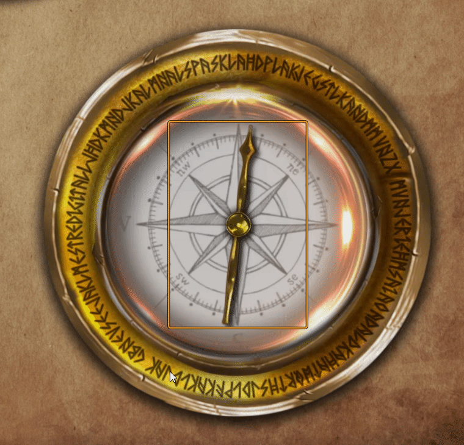

# Compass for Sequencer
This module let you simulate a Compass for your players.

## Demonstration

# How to Install
1. Go to modules and use the link: 
https://raw.githubusercontent.com/brunocalado/compass-for-sequencer/main/module.json

## Instructions
There is a compendium with journals with instructions. Read it!

# Community
- If you want to share an art you made and have permission to distribute [click here](https://github.com/brunocalado/compass-for-sequencer/issues)
- You can report bugs, request features at [issues](https://github.com/brunocalado/compass-for-sequencer/issues)

# Acknowledges
- Heber Maia, The Cheeseman
- @Wasp#2005 - https://github.com/fantasycalendar/FoundryVTT-Sequencer

# Changelog
You can check changes at [CHANGELOG](CHANGELOG.md)

# License
- compass_01.webp, pointer_black.webp, pointer_green.webp by Filho do Chocobo
- compass_digital, compass_fantasy and compass_modern by Heber Maia
- Code: [LICENSE](LICENSE)

# Mestre Digital
About this module creator: https://sites.google.com/view/mestredigitalmodules